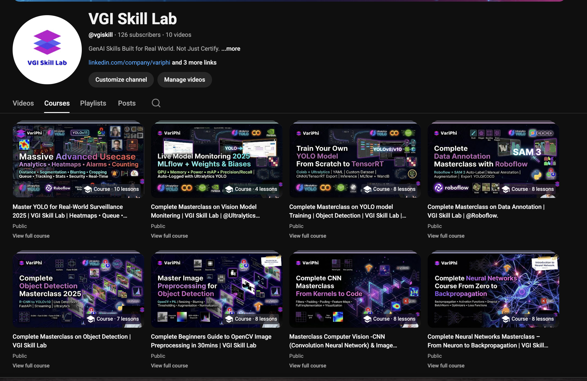
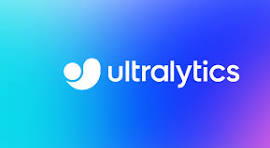
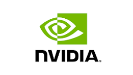
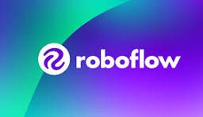
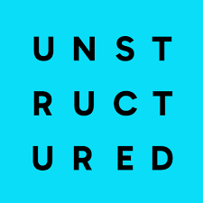

# VGI Resources – Masterclass Library

      

Provider-agnostic, hands-on resources for computer vision, deep learning, and LangChain/RAG masterclasses.

**Masterclass Channel:** https://www.youtube.com/@vgiskill

---

## ⚙️ Tech Stack (at a glance)

- **LLM & Agents:** LangChain, LCEL, LangGraph, tools/agents, memory, RAG
- **Models & Inference:** Ultralytics YOLO (detection/pose/seg), TensorFlow/Keras CNNs & MLPs
- **CV & Media:** OpenCV, PIL, image/video processing, augmentation
- **Vector & RAG:** FAISS, ChromaDB (examples), embeddings (OpenAI/Gemini/HF), retrieval chains
- **Data & Docs:** Unstructured, PDF/text loaders, chunking strategies
- **MLOps & Tracking:** MLflow, Weights & Biases (W&B)
- **Deployment/Export:** TensorFlow Lite (CNN), ONNX (YOLO)
- **Hardware/Infra:** NVIDIA GPUs (CUDA), provider-agnostic APIs (OpenAI, Gemini, Hugging Face)

---

## What’s Inside (Quick Map)

- **Neural_Network_Resources** – Fashion-MNIST MLPs, regularization (BN/Dropout), overfitting diagnostics. Notebook + README.
- **Mastering_CNN_Image_Classification.** – Flower classification with CNNs, data augmentation, dropout, TensorFlow Lite export. Notebook + README.
- **OpenCV_Tutorial** – Image/video loading, color spaces, resizing/cropping, blur, Canny edges, brightness/contrast, drawing, frame extraction. Notebook + README.
- **Object_Detection_Masterclass** – YOLO inference basics, bounding box formats (xywh/xyxy, normalized), manual plotting. Notebook + concise README.
- **Yolo_model_Training_Masterclass** – PPE dataset training with YOLOv8, testing, ONNX export, optional MLflow. Notebook + concise README.
- **Vision_Model_Monitering_WanDB** – YOLO training instrumented for MLflow and W&B logging. Two scripts + README.
- **Pose_estimation_and_Action_Recognition** – YOLO pose training/inference, keypoints & skeletons, video demo script. Notebook + README with images.
- **VGI_Langchain_Resources** – LangChain course (LCEL, memory, RAG, tools, agents, LangGraph, eval). Notebooks + README with course diagrams.
- **VGI_RAG_Resources** – RAG pipeline (load → split → embed → store → retrieve → generate), vector DB notes. Notebook + README with RAG diagrams.
- **Yolo_Application_Solutions_Projects** – Applied YOLO scripts: counting (global/regions), queues/zones, speed/distance, heatmaps, security alarms, segmentation, blurring, cropping, workout monitoring, analytics. README.
- **logos/** – Shared logos and banners.

---

## How to Use

1. Pick a folder for the topic you need (vision, YOLO, LangChain/RAG).
2. Open the README inside that folder for the quick guide and commands.
3. Run the accompanying notebook/script to follow along.
4. Check the YouTube channel for the matching masterclass video.

---

## Quick Links to Key Folders

- `Neural_Network_Resources/`
- `Mastering_CNN_Image_Classification./`
- `OpenCV_Tutorial/`
- `Object_Detection_Masterclass/`
- `Yolo_model_Training_Masterclass/`
- `Vision_Model_Monitering_WanDB/`
- `Pose_estimation_and_Action_Recognition/`
- `VGI_Langchain_Resources/`
- `VGI_RAG_Resources/`
- `Yolo_Application_Solutions_Projects/`

---

**Happy learning and building!**
