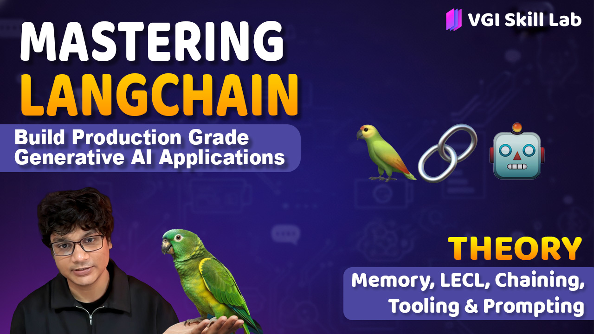
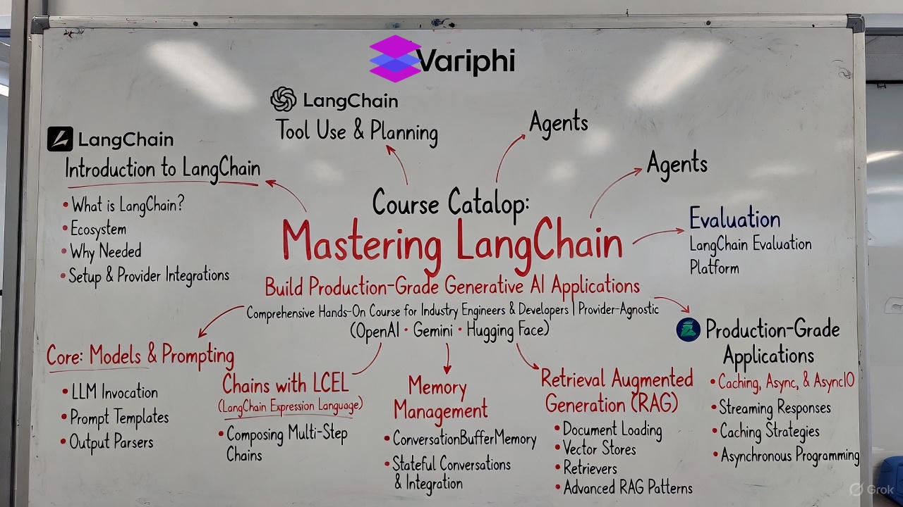
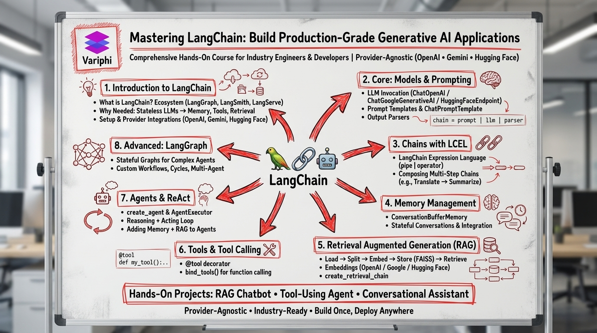

# 🔗 Mastering LangChain: Build Production-Grade Generative AI Applications

[](https://www.youtube.com/@vgiskill)

**YouTube Channel:** https://www.youtube.com/@vgiskill

Comprehensive hands-on course for industry engineers & developers. **Provider-Agnostic** (OpenAI • Gemini • Hugging Face).

---

## 📋 Course Overview

This course teaches you how to build production-ready generative AI applications using **LangChain**, covering everything from basic LLM integration to advanced agent architectures.

**Key Features:**
- ✅ Provider-Agnostic (OpenAI, Gemini, Hugging Face)
- ✅ Industry-Ready Code & Patterns
- ✅ Build Once, Deploy Anywhere
- ✅ Hands-On Projects Included

---

## 📚 Course Modules

### 1. **Introduction to LangChain**
- What is LangChain?
- Ecosystem (LangGraph, LangSmith, LangServe)
- Why Needed: Stateless LLMs → Memory, Tools, Retrieval
- Setup & Provider Integrations (OpenAI, Gemini, Hugging Face)

### 2. **Core: Models & Prompting**
- LLM Invocation (ChatOpenAI / ChatGoogleGenerativeAI / HuggingFaceEndpoint)
- Prompt Templates & ChatPromptTemplate
- Output Parsers
- Chain Composition: `chain = prompt | llm | parser`

### 3. **Chains with LCEL**
- LangChain Expression Language (pipe `|` operator)
- Composing Multi-Step Chains (e.g., Translate → Summarize)
- Sequential Flow Composition

### 4. **Memory Management**
- ConversationBufferMemory
- Stateful Conversations & Integration
- Managing Context Across Interactions

### 5. **Retrieval Augmented Generation (RAG)**
- Document Loading → Splitting → Embedding → Storage (FAISS)
- Embeddings (OpenAI / Google / Hugging Face)
- `create_retrieval_chain`
- Advanced RAG Patterns

### 6. **Tools & Tool Calling**
- `@tool` decorator
- `bind_tools()` for function calling
- Creating Custom Tools
- Tool Integration Patterns

### 7. **Agents & ReAct**
- `create_agent` & `AgentExecutor`
- Reasoning + Acting Loop
- Adding Memory + RAG to Agents
- Multi-Agent Systems

### 8. **Advanced: LangGraph**
- Stateful Graphs for Complex Agents
- Custom Workflows, Cycles, Multi-Agent
- Production Deployment Patterns

### 9. **Production-Grade Applications**
- Caching, Async, & AsyncIO
- Streaming Responses
- Caching Strategies
- Asynchronous Programming

### 10. **Evaluation**
- LangChain Evaluation Platform
- Testing & Validation

---

## 🛠️ Hands-On Projects

The course includes practical projects:

1. **RAG Chatbot** - Build a document-based Q&A system
2. **Tool-Using Agent** - Create agents that use external tools
3. **Conversational Assistant** - Build stateful, memory-enabled assistants

---

## 📦 Prerequisites

- **Python 3.8+**
- Basic understanding of Python programming
- Familiarity with LLMs (helpful but not required)
- API keys for your chosen provider (OpenAI, Gemini, or Hugging Face)

---

## 🚀 Installation

```bash
pip install langchain langchain-openai langchain-google-genai langchain-huggingface
pip install langchain-community langgraph langsmith
pip install faiss-cpu  # or faiss-gpu for GPU support
pip install chromadb  # alternative vector store
```

**Optional but Recommended:**
```bash
pip install jupyter notebook  # for running notebooks
pip install python-dotenv     # for managing API keys
```

---

## 📁 Project Structure

```
VGI_Langchain_Resources/
│
├── Variphi_LangChain.ipynb      # Main comprehensive course notebook
├── variphi_langchain2.ipynb     # Additional examples/advanced topics
└── README.md                     # This file
```

---

## 🎯 Key Learning Outcomes

By completing this course, you will:

✅ Understand LangChain's architecture and ecosystem  
✅ Build chains using LangChain Expression Language (LCEL)  
✅ Implement memory for stateful conversations  
✅ Create RAG systems for document-based applications  
✅ Build agents that can use tools and reason  
✅ Deploy production-ready LangChain applications  
✅ Work with multiple LLM providers seamlessly  

---

## 💡 Course Structure Visual

The course follows a structured progression:

```
Introduction → Core Concepts → Chains → Memory → RAG → Tools → Agents → LangGraph → Production
```

Each module builds on the previous one, taking you from basic LLM integration to complex multi-agent systems.

### Course Mind Map





*The course structure visualizes all 8+ modules and their relationships, showing how each component connects to build production-grade applications.*

---

## 🔑 Key Concepts

### Provider-Agnostic Design
- Switch between OpenAI, Gemini, and Hugging Face models easily
- Same code works across different providers
- No vendor lock-in

### LangChain Expression Language (LCEL)
- Use the pipe `|` operator to compose chains
- Declarative, readable chain definitions
- Automatic parallelization and optimization

### Memory Management
- Transform stateless LLMs into stateful applications
- Maintain conversation context
- Integrate with chains and agents

### RAG Pipeline
- Load documents → Split → Embed → Store → Retrieve
- Enhance LLM responses with external knowledge
- Build document-based Q&A systems

### Agents & Tools
- Enable LLMs to use external functions
- ReAct pattern: Reasoning + Acting
- Build autonomous systems that can interact with the world

---

## 📖 How to Use This Course

1. **Start with the Main Notebook**: Open `Variphi_LangChain.ipynb`
2. **Follow Module Order**: Work through modules sequentially
3. **Run Code Examples**: Execute cells to see concepts in action
4. **Complete Projects**: Build the hands-on projects to reinforce learning
5. **Experiment**: Modify examples to suit your use cases

---

## 🎓 Best Practices

- **Use Environment Variables**: Store API keys securely
- **Start Simple**: Begin with basic chains before moving to agents
- **Test Incrementally**: Verify each component before composing
- **Monitor Costs**: Track API usage across providers
- **Version Control**: Keep track of different chain configurations

---

## 🔗 Additional Resources

- [LangChain Documentation](https://python.langchain.com/)
- [LangGraph Documentation](https://langchain-ai.github.io/langgraph/)
- [LangSmith Platform](https://smith.langchain.com/)
- [LangChain Hub](https://smith.langchain.com/hub)

---

## 📝 Notes

- **API Keys**: You'll need API keys for your chosen provider(s)
- **Vector Stores**: FAISS is used in examples, but ChromaDB, Pinecone, etc. work too
- **Notebook Format**: All code is in Jupyter notebooks for interactive learning
- **Provider Switching**: Examples show how to switch between providers easily

---

## 🚀 Next Steps

After completing this course:

1. **Build Your Own RAG System**: Apply RAG to your documents
2. **Create Custom Agents**: Build agents for your specific use cases
3. **Deploy to Production**: Use LangServe for API deployment
4. **Monitor with LangSmith**: Track and debug your applications
5. **Explore LangGraph**: Build complex, stateful agent workflows

---

**Happy Learning! 🚀**

*Master LangChain and build production-grade generative AI applications that work across any provider!*

