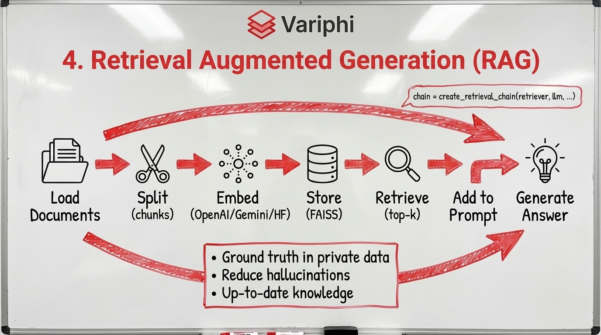
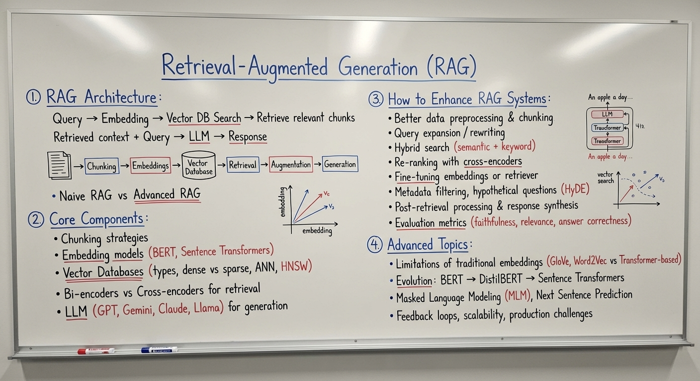
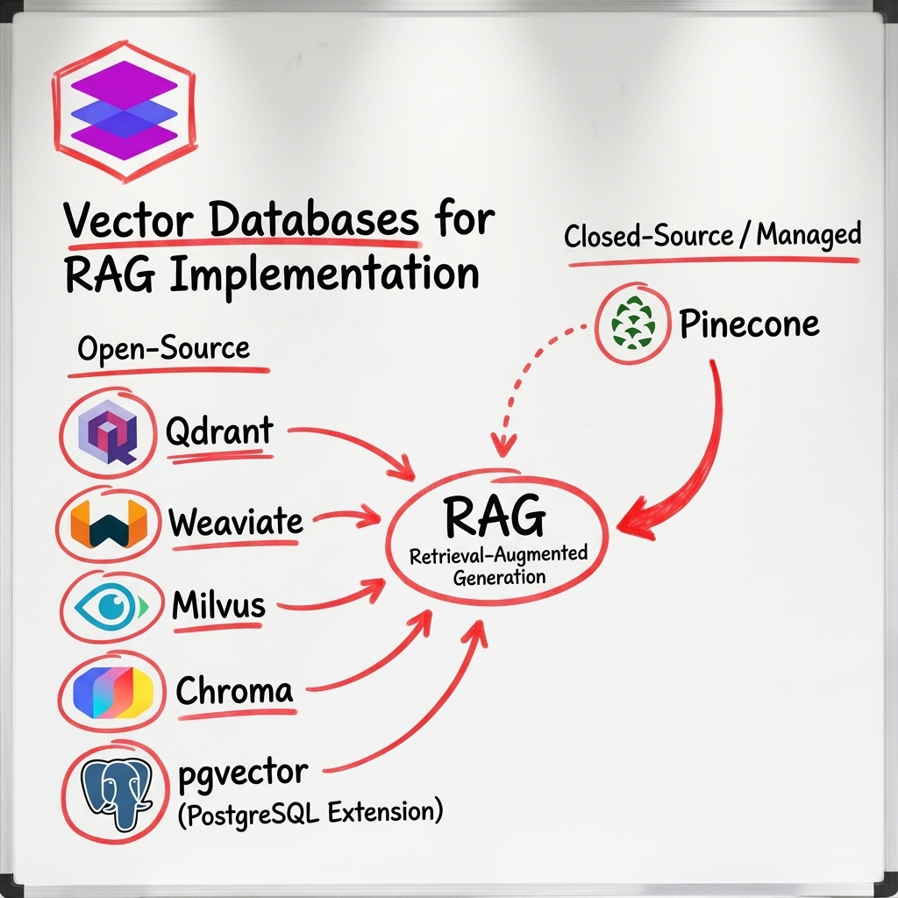

# 📚 RAG (Retrieval Augmented Generation) Masterclass

Comprehensive guide to building **Retrieval Augmented Generation** systems using LangChain. Learn how to create document-based Q&A systems, chatbots, and knowledge assistants that combine LLMs with your own data.

---

## 🎯 Introduction





**Retrieval Augmented Generation (RAG)** is a powerful technique that enhances Large Language Models (LLMs) by retrieving relevant information from external knowledge bases before generating responses. This allows LLMs to:

- ✅ Answer questions about your specific documents
- ✅ Access up-to-date information not in training data
- ✅ Reduce hallucinations by grounding responses in retrieved context
- ✅ Build domain-specific applications without retraining models

---

## 📋 What You'll Learn

This masterclass covers the complete RAG pipeline:

- **Document Loading** - Load data from various sources (PDFs, text files, web pages, databases)
- **Text Splitting** - Chunk documents into manageable pieces
- **Embeddings** - Convert text into vector representations
- **Vector Stores** - Store and search embeddings efficiently (FAISS, ChromaDB, Pinecone)
- **Retrieval** - Find relevant context for queries
- **Generation** - Use LLMs to generate answers based on retrieved context
- **Advanced RAG Patterns** - Multi-step retrieval, re-ranking, and query expansion

---

## 📦 Prerequisites

- **Python 3.8+**
- Basic understanding of Python programming
- Familiarity with LangChain (helpful but not required)
- API keys for your chosen LLM provider (OpenAI, Gemini, Hugging Face)

---

## 🚀 Installation

```bash
pip install langchain langchain-openai langchain-google-genai
pip install langchain-community langchain-huggingface
pip install faiss-cpu  # or faiss-gpu for GPU support
pip install chromadb   # alternative vector store
pip install pypdf      # for PDF loading
pip install unstructured # for document processing
```

**Optional:**
```bash
pip install jupyter notebook  # for running notebooks
pip install python-dotenv      # for managing API keys
```

---

## 📁 Project Structure

```
VGI_RAG_Resources/
│
├── Variphi_RAG.ipynb          # Main comprehensive RAG tutorial notebook
├── RAG.jpeg                    # RAG system overview diagram
├── RAG_1.jpeg                 # RAG architecture details
├── Vector_database.jpeg        # Vector database concepts
├── unstructured.png           # Document processing illustration
└── README.md                  # This file
```

---

## 🔑 Core RAG Concepts

### The RAG Pipeline

```
Documents → Load → Split → Embed → Store → Retrieve → Generate
```

1. **Load**: Import documents from various sources
2. **Split**: Break documents into chunks (with overlap for context)
3. **Embed**: Convert text chunks into vector embeddings
4. **Store**: Save embeddings in a vector database
5. **Retrieve**: Find most relevant chunks for a query
6. **Generate**: Use LLM to create response from retrieved context

### Key Components

**Document Loaders:**
- PDF loaders, text loaders, web scrapers, database connectors

**Text Splitters:**
- Character-based, token-based, semantic chunking
- Overlap strategies for maintaining context

**Embeddings:**
- OpenAI embeddings, Google embeddings, Hugging Face models
- Provider-agnostic embedding interfaces

**Vector Stores:**
- FAISS (local, fast)
- ChromaDB (local, feature-rich)
- Pinecone (cloud, scalable)
- Weaviate, Qdrant, and more

**Retrievers:**
- Similarity search
- MMR (Maximum Marginal Relevance) for diversity
- Contextual compression
- Re-ranking strategies

---

## 🛠️ How to Use

1. **Open the Notebook**: Start with `Variphi_RAG.ipynb`
2. **Set Up API Keys**: Configure your LLM provider credentials
3. **Prepare Documents**: Have your documents ready (PDFs, text files, etc.)
4. **Follow the Pipeline**: Work through each step of the RAG process
5. **Build Your Application**: Adapt examples to your use case

---

## 💡 Common Use Cases

- **Document Q&A Systems** - Ask questions about your documents
- **Knowledge Base Chatbots** - Customer support with company docs
- **Research Assistants** - Analyze papers and articles
- **Code Documentation** - Query codebases and documentation
- **Legal/Medical Applications** - Search through specialized documents

---

## 🎓 Key Takeaways

✅ **RAG enhances LLMs** by adding external knowledge retrieval  
✅ **Vector databases** enable fast semantic search  
✅ **Chunking strategy** is crucial for good retrieval  
✅ **Embedding quality** directly impacts system performance  
✅ **Provider-agnostic** design allows switching between LLMs easily  
✅ **Advanced patterns** (re-ranking, multi-step) improve accuracy  

---

## 📖 Additional Resources

- [LangChain RAG Documentation](https://python.langchain.com/docs/use_cases/question_answering/)
- [Vector Store Comparison](https://python.langchain.com/docs/integrations/vectorstores/)
- [Embedding Models Guide](https://python.langchain.com/docs/integrations/text_embedding/)
- [Advanced RAG Techniques](https://python.langchain.com/docs/use_cases/question_answering/)

---

## 🔍 Vector Database Concepts



Vector databases store embeddings and enable efficient similarity search, making them the backbone of RAG systems.

---

## 📝 Notes

- **API Costs**: Be mindful of embedding and LLM API usage
- **Chunk Size**: Experiment with different chunk sizes for your documents
- **Overlap**: Use overlap between chunks to maintain context
- **Retrieval Strategy**: Choose retrieval method based on your needs (similarity, MMR, etc.)
- **Evaluation**: Test your RAG system with relevant queries

---

## 🚀 Next Steps

After mastering RAG basics:

1. **Optimize Retrieval** - Try different chunking and retrieval strategies
2. **Add Re-ranking** - Improve relevance with re-ranking models
3. **Multi-Step RAG** - Implement complex retrieval workflows
4. **Production Deployment** - Deploy your RAG system with LangServe
5. **Evaluation** - Measure and improve system performance

---

**Happy Building! 🚀**

*Master RAG and build intelligent applications that combine the power of LLMs with your own knowledge base!*

